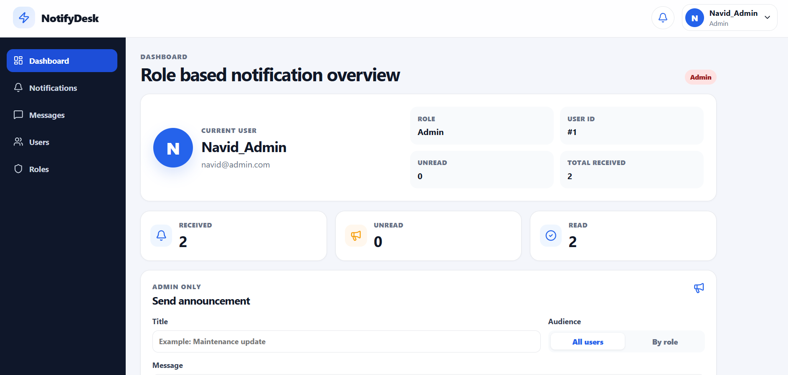
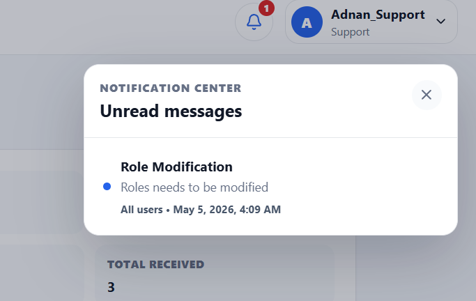

# Role-Based Notification System

This is a full-stack role-based notification dashboard built for an assessment task. The application lets an admin send announcements to all users or selected roles, while each user has a personal inbox with unread counts, read/unread state, filtering, search, and real-time delivery through WebSockets.

## Links

- Live deployment: 
- Demo recording: https://drive.google.com/file/d/1zIZ9zk4jomKneujqHjKa5Y87L2gNAFal/view?usp=sharing 
- GitHub repository: https://github.com/TheOnlyNaimur/notification-system.git 

## Screenshots

### Dashboard



### Notification Composer



### Notification Panel


## Features

- Seeded role system with Admin, Manager, Editor, Viewer, and Support roles.
- Six seeded demo users, each assigned to one role.
- User switcher for assessment/demo purposes instead of a login flow.
- Admin-only notification composer.
- Send notifications to all users or only selected roles.
- Per-user notification delivery records, so each user has independent read/unread state.
- Newest-first inbox view.
- Search notifications by title or message.
- Filter notifications by all, unread, or read.
- Real-time notification delivery with WebSockets.
- Notification bell with unread badge.
- Notification center modal for unread messages.
- Mark notifications as read or unread.
- Responsive dashboard UI built with reusable React components.

## Tech Stack


| Layer | Technologies |
| --- | --- |
| Frontend | React 19, Vite, JavaScript / JSX |
| Styling | CSS, lucide-react icons |
| Backend | Python, FastAPI, Pydantic |
| Database | PostgreSQL, SQLAlchemy ORM (No cloud server was used) |
| Real-time | FastAPI WebSockets |
| Tooling | Node.js, npm, ESLint, Docker Compose, Uvicorn |


### Infrastructure / Tooling

- Docker Compose for local PostgreSQL
- npm for frontend package management
- pip / virtual environment for backend dependencies

## Project Structure

```txt
.
|-- backend/
|   |-- database.py          # Database connection and SQLAlchemy session setup
|   |-- init_db.py           # Creates tables and seeds roles/users
|   |-- main.py              # FastAPI routes, schemas, and WebSocket manager
|   `-- models.py            # SQLAlchemy models
|-- frontend/
|   |-- src/
|   |   |-- components/      # Reusable dashboard components
|   |   |-- utils/           # Formatting helpers and constants
|   |   |-- App.jsx          # Main app state and business logic
|   |   |-- config.js        # Backend API/WebSocket URLs
|   |   `-- index.css        # Main styling
|   |-- package.json
|   `-- vite.config.js
|-- screens/                  # README screenshots and database schema image
|-- docker-compose.yml       # PostgreSQL service
`-- README.md
```

## Local Setup Instructions

### Prerequisites

Make sure these are installed:

- Python 3.10 or newer
- Node.js 18 or newer
- npm
- Docker Desktop

### 1. Clone the Repository

```bash
git clone <your-repository-url>
cd notification-system
```

### 2. Start PostgreSQL

From the project root:

```bash
docker compose up -d
```

This starts a PostgreSQL 15 container with:

- Database: `notification_system`
- User: `naimur`
- Password: `1234`
- Port: `5432`

### 3. Set Up the Backend

Create and activate a virtual environment.

Windows PowerShell:

```bash
cd backend
python -m venv venv
.\venv\Scripts\Activate.ps1
cd ..
```

macOS/Linux:

```bash
cd backend
python -m venv venv
source venv/bin/activate
cd ..
```

With the backend virtual environment activated, install backend dependencies from the project root:

```bash
pip install fastapi uvicorn sqlalchemy psycopg2-binary pydantic
```

Initialize the database and seed demo data from the project root:

```bash
python -m backend.init_db
```

Start the backend API from the project root:

```bash
uvicorn backend.main:app --reload
```

The backend will run at:

```txt
http://127.0.0.1:8000
```

FastAPI docs are available at:

```txt
http://127.0.0.1:8000/docs
```

### 4. Set Up the Frontend

Open a new terminal from the project root:

```bash
cd frontend
npm install
npm run dev
```

The frontend will run at:

```txt
http://localhost:5173
```

## Demo Users

The seed script creates these users:

| Username | Email | Role |
| --- | --- | --- |
| `Navid_Admin` | `navid@admin.com` | Admin |
| `Sadek_Manager` | `sadek@manager.com` | Manager |
| `Ovijit_Editor` | `ovijit@editor.com` | Editor |
| `Monamy_Viewer` | `monamy@viewer.com` | Viewer |
| `Adnan_Support` | `adnan@support.com` | Support |
| `Moin_Viewer` | `moin@viewer.com` | Viewer |

The app uses a user switcher in the top navigation so the reviewer can quickly test each user's notification inbox without needing authentication.

## How to Test the Main Flow

1. Start PostgreSQL, backend, and frontend.
2. Open `http://localhost:5173`.
3. Keep the selected user as `Navid_Admin`.
4. Use the admin announcement form to send a notification to all users.
5. Open the notification bell or inbox and confirm the new notification appears.
6. Switch to another user from the profile dropdown.
7. Confirm that the notification appears in that user's inbox.
8. Send another notification to only the `Viewer` role.
9. Switch between `Monamy_Viewer`, `Moin_Viewer`, and a non-viewer user to confirm role-based delivery.
10. Mark a notification read/unread and confirm the unread count updates.

## API Overview

| Method | Endpoint | Description |
| --- | --- | --- |
| `GET` | `/` | Health/root message for the API |
| `GET` | `/roles` | Returns all seeded roles |
| `GET` | `/users` | Returns all seeded users with role names |
| `GET` | `/notifications?user_id={id}` | Returns notifications delivered to one user |
| `GET` | `/notifications/unread-count/{user_id}` | Returns unread count for a user |
| `POST` | `/notifications` | Creates and delivers a notification |
| `PATCH` | `/notifications/{state_id}/read` | Updates read/unread state for one delivered notification |
| `WS` | `/ws/{user_id}` | Streams new notifications to the active user |

### Create Notification Payload

Send to all users:

```json
{
  "title": "Maintenance update",
  "message": "The system will be updated tonight.",
  "audience_type": "all",
  "role_ids": []
}
```

Send to selected roles:

```json
{
  "title": "Editor notice",
  "message": "Please review the latest content updates.",
  "audience_type": "roles",
  "role_ids": [3]
}
```

## Database Design

The backend uses four main tables:

- `roles`: stores role names.
- `users`: stores demo users and links each user to one role.
- `notifications`: stores the notification content and targeting metadata.
- `notification_states`: stores per-user delivery state, including `is_read` and `delivered_at`.

The separate `notification_states` table is important because one notification can be delivered to many users, and each user needs their own read/unread state.

### Database Schema Diagram


The diagram should show these relationships:

| Relationship | Meaning |
| --- | --- |
| `roles` -> `users` | One role can belong to many users. |
| `notifications` -> `notification_states` | One notification can be delivered to many users. |
| `users` -> `notification_states` | One user can receive many notifications. |

### SQL Schema Reference

```sql
CREATE TABLE roles (
    id INTEGER PRIMARY KEY,
    name VARCHAR UNIQUE NOT NULL
);

CREATE TABLE users (
    id INTEGER PRIMARY KEY,
    username VARCHAR UNIQUE NOT NULL,
    email VARCHAR UNIQUE NOT NULL,
    role_id INTEGER NOT NULL REFERENCES roles(id)
);

CREATE TABLE notifications (
    id INTEGER PRIMARY KEY,
    title VARCHAR(160) NOT NULL,
    message TEXT NOT NULL,
    audience_type VARCHAR(20) NOT NULL DEFAULT 'all',
    role_ids JSONB NOT NULL DEFAULT '[]',
    created_at TIMESTAMP WITH TIME ZONE NOT NULL DEFAULT now()
);

CREATE TABLE notification_states (
    id INTEGER PRIMARY KEY,
    notification_id INTEGER NOT NULL REFERENCES notifications(id),
    user_id INTEGER NOT NULL REFERENCES users(id),
    is_read BOOLEAN NOT NULL DEFAULT false,
    delivered_at TIMESTAMP WITH TIME ZONE NOT NULL DEFAULT now()
);
```

### Important Columns

| Table | Important columns | Purpose |
| --- | --- | --- |
| `roles` | `id`, `name` | Stores available user roles. |
| `users` | `id`, `username`, `email`, `role_id` | Stores seeded demo users and their assigned role. |
| `notifications` | `id`, `title`, `message`, `audience_type`, `role_ids`, `created_at` | Stores notification content and target audience metadata. |
| `notification_states` | `id`, `notification_id`, `user_id`, `is_read`, `delivered_at` | Tracks delivery and read/unread status separately for each user. |

## Assumptions and Design Decisions

- Authentication was not implemented because the assessment focuses on role-based notifications. A user switcher is used to make reviewer testing faster.
- Only Admin users can see and use the announcement composer in the frontend.
- A user has one role in this implementation. This keeps the role-targeting logic simple and clear for the assessment scope.
- Notifications are delivered by creating one `NotificationState` row per recipient. This makes unread counts and read/unread toggles independent for every user.
- Role-targeted notifications store the selected `role_ids` on the notification record so the original audience can still be displayed later.
- The inbox is loaded from the API when switching users, then updated live through a user-specific WebSocket connection.
- Search and read/unread filters are handled on the frontend because each user's inbox is small in the seeded assessment data.
- The backend allows local frontend origins on ports `5173` and `5174` for Vite development.
- Database credentials are hardcoded for local assessment setup. In production, these should be moved to environment variables.
- The seed script is idempotent for roles/users, so it can be rerun without duplicating the seeded demo accounts.

## Code Quality Notes

- Frontend UI is split into focused components such as `TopNav`, `Sidebar`, `UserCard`, `StatsRow`, `AdminAnnouncementCard`, `NotificationPanel`, and `NotificationModal`.
- Shared display helpers live in `frontend/src/utils`.
- API and WebSocket base URLs are centralized in `frontend/src/config.js`.
- Backend schemas, route handlers, serialization helpers, and WebSocket connection management are kept in `backend/main.py`.
- SQLAlchemy models are separated into `backend/models.py`.
- Comments are added around important logic and design decisions, especially filtering, user switching, WebSocket delivery, and notification state updates.

## Validation

Frontend checks:

```bash
cd frontend
npm run lint
npm run build
```

Manual backend validation:

```bash
python -m backend.init_db
uvicorn backend.main:app --reload
```

Then open:

```txt
http://127.0.0.1:8000/docs
```

## Deployment Notes

For deployment, update these values in `frontend/src/config.js`:

```js
export const API_BASE = 'https://your-backend-url.com';
export const WS_BASE = 'wss://your-backend-url.com';
```

Also update the backend CORS `allow_origins` list in `backend/main.py` to include the deployed frontend URL.

Recommended deployment split:

- Frontend: Vercel, Netlify, or any static hosting provider.
- Backend: Render, Railway, Fly.io, or another Python/FastAPI-friendly host.
- Database: Managed PostgreSQL from the same hosting provider or a dedicated PostgreSQL service.


## Developer : Naimur Islam 

[Back to top](#role-based-notification-system)
